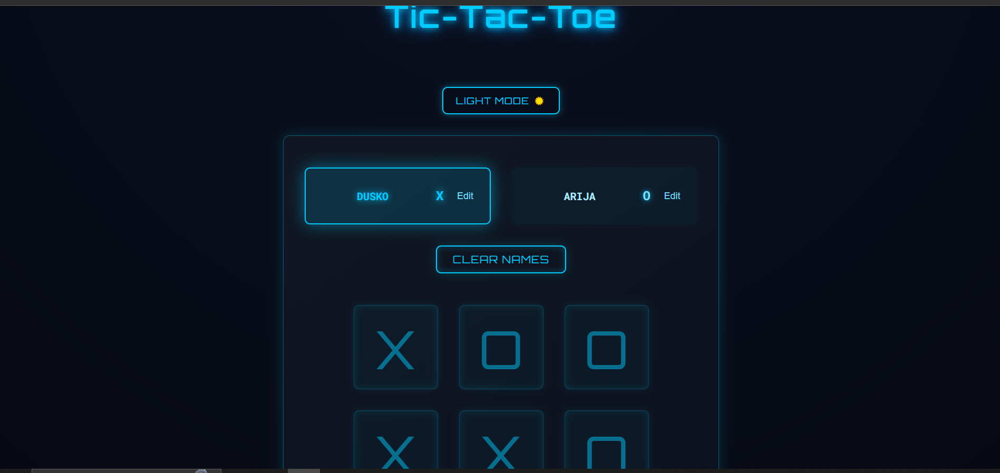
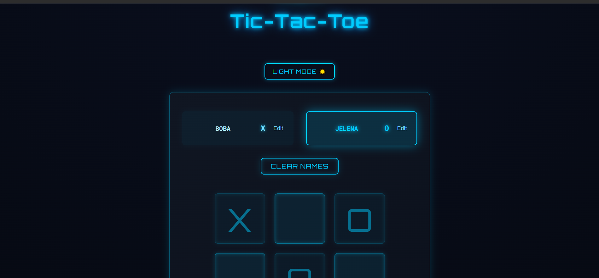
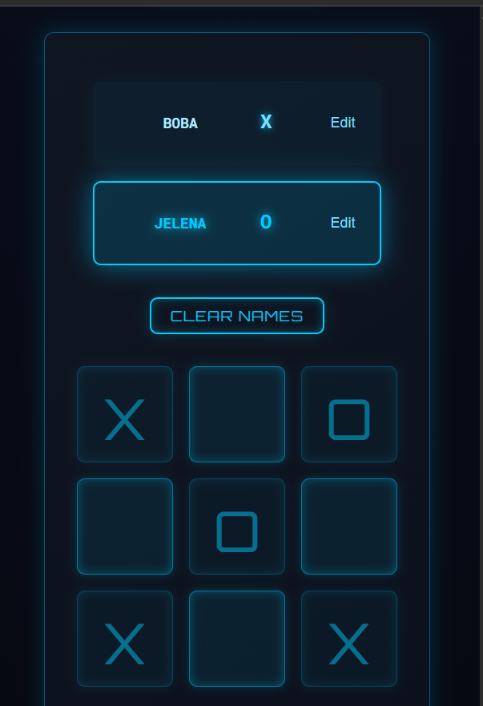
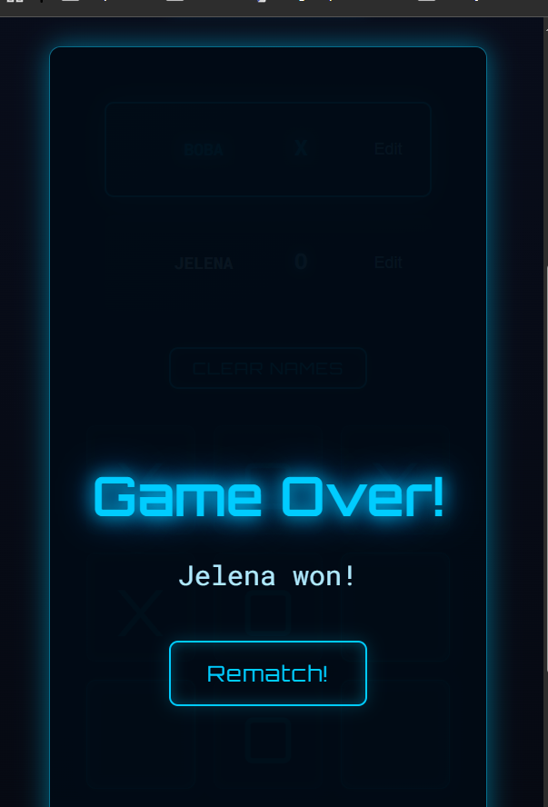

# Tic-Tac-Toe Future with Dark/Light Mode and Clear Names Button

This project is a modern, responsive **Tic-Tac-Toe with Dark/Light Mode and Clear Names Button** based on classic game featuring:

- **Dynamic player name editing** — with real-time updates
- **Active player highlighting** — glowing neon effect for the current player
- **Game-over modal** — displays the winner or draw state
- **Reset and clear name functions** — for quick replayability
- **Turn-based logic** — fully handled through React state management
- **Custom winning combinations** — implemented via validation logic
- **Futuristic neon UI** — styled entirely with CSS
- **Fully responsive layout** — optimized for desktop, tablet, and mobile screens
- **Dark / Light mode toggle** — seamless theme switching for a modern experience



---

## Demo

Ready to test-drive the project? The demo is just [one click]() away!

---

## Navigation

- [Description](#-description)
- [Demo](#-demo)
- [Navigation](#-navigation)
- [Technologies Used](#-technologies-used)
- [Features](#-features)
- [Project Structure](#-project-structure)
- [How to Play](#-how-to-play)
- [Game Logic Overview](#-game-logic-overview)
- [Installation and Setup](#-installation-and-setup)
- [UI and Design](#-ui-and-design)
- [Key Learnings](#-key-learnings)
- [Future Improvements](#-future-improvements)
- [Screenshots](#-screenshots)
- [Built With](#-built-with)
- [Contrinution / Support](#-contribution-support)
- [License](#-license)
- [Author](#-author)
- [Acknowledgments](#-acknowledgments)
- [Changelog](#-changelog)
- [Links](#-links)
- [Project Status](#-project-status)
- [End of Document](#-end-of-document)

---

## Technologies Used

- **React.js** — component-based UI architecture
- **JavaScript (ES6+)** — core game logic and interactivity
- **HTML5** — semantic structure of the application
- **CSS3** — futuristic neon styling and responsive design
- **Vite** — fast development server and build tool
- **Node.js & npm** — package management and local development environment

---

## Features

- **Real-time gameplay** between two players
- **Editable player names** with instant feedback
- **Active player highlighting** with smooth animation
- **Automatic winner detection** using custom validation logic
- **Game-over modal** with restart and replay options
- **Draw state recognition** after the board is full
- **Reset player names** to default values with one click
- **Responsive grid layout** optimized for all devices
- **Neon glow visual effects** for a futuristic and immersive look
- **Dark / Light mode toggle** for personalized gameplay experience

---

## Project Structure

```
tic-tac-toe-future-dark-light-mode/
├── public/
│ └── index.html
├── src/
│ ├── assets/
│ │ └── react.svg
│ ├── components/
│ │ ├── GameBoard/
│ │ │ ├── GameBoard.jsx
│ │ │ └── GameBoard.css
│ │ ├── GameOver/
│ │ │ └── GameOver.jsx
│ │ ├── Log/
│ │ │ └── Log.jsx
│ │ └── Player/
│ │ ├── Player.jsx
│ │ └── Player.css
│ ├── App.jsx
│ ├── index.css
│ ├── index.jsx
│ ├── utils.js
│ └── winning-combinations.js
├── .gitignore
├── index.html
├── package.json
├── package-lock.json
├── screenshot.png
├── vite.config.js
└── README.md

```

---

## How to Play

1. Enter player names or keep the default ones.
2. Use the **Dark / Light Mode** toggle to choose your preferred theme.
3. The **highlighted player** starts the game.
4. Click on any empty square to place your symbol (**X** or **O**).
5. Players take turns automatically after each move.
6. The game automatically detects when a player wins or if the match ends in a draw.
7. Click **“Rematch!”** to start a new round, or **“Clear Names”** to reset player names.

---

## Game Logic Overview

- The game board is represented as a **3×3 matrix** stored in React state.
- Each move updates the matrix with the **current player's symbol** (X or O).
- The **`winning-combinations.js`** file defines all possible victory patterns (rows, columns, diagonals).
- After every move, the game checks for **three matching symbols** in any of these patterns.
- If a winning combination is found, the corresponding player is declared the **winner**.
- If all nine squares are filled without a winner, the game automatically declares a **draw**.
- React’s **state management** ensures real-time updates and smooth re-rendering of components.
- The logic is modularized through **utility functions** (`deriveWinner`, `deriveActivePlayer`, `deriveGameBoard`) for better readability and maintenance.

---

### Installation and Setup

1. Clone the repository.

```Bash
git clone https://github.com/D-vokic/tic-tac-toe-future.git
```

2. Navigate to the project folder:

```Bash
cd tic-tac-toe-future
```

3. Install dependencies:

```Bash
npm install
```

4. Start the development server:

```Bash
npm run dev
```

5. Open your browser and go to:

```Bash
http://localhost:5173
```

---

## UI and Design

- The interface features a **futuristic neon aesthetic** with glowing blue and cyan tones.
- All elements utilize **CSS3 transitions, shadows, and gradients** to enhance interactivity and depth.
- The **active player** is highlighted with a **pulsating neon glow effect** for clear visibility.
- Buttons include **hover animations** and **smooth scaling transitions** for responsive feedback.
- The layout is **fully responsive**, adapting seamlessly to desktop, tablet, and mobile screens.
- The **Dark / Light mode toggle** dynamically changes themes for different visual preferences.
- A **dark background** emphasizes neon highlights, creating a distinct **cyber-themed atmosphere**.

---

## Key Learnings

- Strengthened understanding of **React state management** and **component communication**.
- Implemented **derived state logic** to handle dynamic and reactive game updates.
- Improved proficiency in **responsive web design** and **adaptive grid layouts**.
- Practiced **CSS animations**, **transitions**, and **neon glow effects** for modern UI design.
- Gained hands-on experience in **structuring React projects** using modular and reusable components.
- Enhanced **debugging**, **refactoring**, and **code organization** skills for cleaner and more maintainable projects.
- Learned to integrate **dark/light mode switching** through React’s state and DOM manipulation.

---

## 🔮 Future Improvements

- Add **score tracking** across multiple rounds to track player performance.
- Implement an **AI opponent** for single-player mode using minimax or heuristic algorithms.
- Introduce **sound effects** for moves, wins, and game-over events to enhance immersion.
- Expand the **theme switcher** with additional neon color palettes and gradient variations.
- Include **player avatars** or customizable **profile icons** for a personalized touch.
- Create an **online multiplayer mode** using WebSockets or Firebase real-time database.
- Add **animated winning lines** and smooth **transition effects** between game states.
- Implement **localStorage** or **session persistence** to remember player names and theme preferences.

---

## Screenshots

| Normal View                  | Responsive View                      | Game Over Screen              |
| ---------------------------- | ------------------------------------ | ----------------------------- |
|  |  |  |

---

## Built With

- [HTML](https://developer.mozilla.org/en-US/docs/Web/HTML) - The markup language used
- [CSS](https://developer.mozilla.org/en-US/docs/Web/CSS) - The style sheet language used
- [JavaScript](https://developer.mozilla.org/en-US/docs/Web/JavaScript) - The programming language used
- [React](https://developer.mozilla.org/en-US/docs/Learn_web_development/Core/Frameworks_libraries/React_getting_started) - The JS library used
- [Vite](https://vite.dev/guide/) - The deploying tool for app used

---

## Contributing / Support

For questions, feedback, or suggestions, feel free to open an **issue** on the repository  
or contact the author via **GitHub**: [D-vokic](https://github.com/D-vokic)

---

## License

This project is licensed under the MIT License - see the [LICENSE.md](LICENSE.md) file for details — you are free to use, modify, and distribute it with proper attribution.

---

## Author

**Author:** Duško Vokić  
**Role:** Front-End Developer & System Administrator

This project is maintained by me. You can reach out to me on [GitHub]() or [LinkedIn](https://www.linkedin.com/in/duskovokic/) for any queries or suggestions.

---

## Acknowledgments

Special thanks to the **React** and **Vite** communities for their excellent tools and documentation,  
and to all developers who inspire clean code and creative UI design.

--

## Changelog

### v1.0.0

- Initial project release
- Implemented core Tic-Tac-Toe logic
- Added responsive neon UI
- Introduced player name editing and highlight effects
- Included game-over modal with restart and clear options

---

## Links

- **Live Demo:** [Tic-Tac-Toe Future with Dark/Light Mode and Clear Names Button]()
- **Repository:** [GitHub Repo](https://github.com/D-vokic/tic-tac-toe-future)

---

## Project Status

**Current Version:** 1.0.0  
**Status:** Completed and fully functional  
**Last Update:** November 2025

---

## End of Document

Thank you for exploring **Tic-Tac-Toe Future with Dark/Light Mode and Clear Names Button**!  
Enjoy the game and keep building amazing projects. 🚀

---
